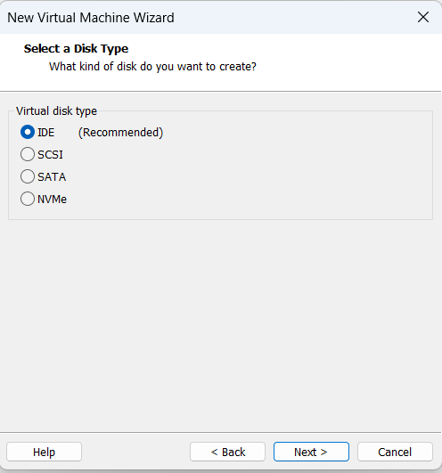

# Установка EcoRouter на ESXi 8

Имеем образ EcoRouter в qcow2 формате.

Шаг 1. Конвертируем qcow2 в vmdk

Используем qumu-img скачать можно [здесь](https://cloudbase.it/downloads/qemu-img-win-x64-2_3_0.zip)

ipv6.qcow2 - имя файла образа EcoRouter в формате qcow2

ipv6.vmdk - имя файла результата конвертации образа EcoRouter (может быть любым) 

```
qemu-img.exe convert -f qcow2 ipv6.qcow2 -O vmdk ipv6.vmdk
```

Напрямую в Esxi прикрутить этот диск к виртуалке так и не получилось.

Поэтому идем обходным путем через VMware Workstation

<p align="center">
  
</p>

<p align="center">
  
</p>

<p align="center">
  
</p>

<p align="center">
  
</p>

<p align="center">
  
</p>

<p align="center">
  
</p>

<p align="center">
  
</p>

<p align="center">
  
</p>

<p align="center">
  
</p>

<p align="center">
  
</p>

<p align="center">
  
</p>

<p align="center">
  
</p>

<p align="center">
  
</p>

Запускаем. Будет ругаться на serial интерфейс. Ничего страшного потом исправим

<p align="center">
  
</p>

Выключаем и делаем экспорт в OVF формат

<p align="center">
  
</p>

Переходим в Esxi и делаем импорт

<p align="center">
  
</p>

<p align="center">
  
</p>

<p align="center">
  
</p>

После импорта виртуалка автоматом запускается. Выключаем ее.