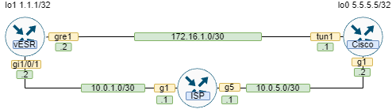

# IPSec over GRE между Cisco и Eltex

## Топология


## Cisco

```
crypto isakmp policy 11
 encryption aes 256
 hash sha512
 authentication pre-share
 group 16
!
crypto isakmp key Cisco123 address 10.0.1.2
!
crypto ipsec transform-set AES_SHA_ELTEX esp-aes 256 esp-sha512-hmac 
 mode transport
!
crypto ipsec profile IPSEC_PROFILE_ELTEX
 set transform-set AES_SHA_ELTEX 
 set pfs group16
!
interface Loopback0
 ip address 5.5.5.5 255.255.255.255
 ip ospf network point-to-point
!
interface Tunnel1
 ip address 172.16.1.1 255.255.255.252
 ip mtu 1418
 ip ospf network point-to-point
 tunnel source 10.0.5.2
 tunnel destination 10.0.1.2
 tunnel protection ipsec profile IPSEC_PROFILE_ELTEX
!
interface GigabitEthernet1
 ip address 10.0.5.2 255.255.255.252
 negotiation auto
 no mop enabled
 no mop sysid
!
router ospf 1
 network 5.5.5.5 0.0.0.0 area 0
 network 172.16.1.0 0.0.0.3 area 0
!
ip route 0.0.0.0 0.0.0.0 10.0.5.1
```

## Eltex

```
router ospf 1
  router-id 1.1.1.1
  area 0.0.0.0
    enable
  exit
  enable
exit

interface gigabitethernet 1/0/1
  ip firewall disable
  ip address 10.0.1.2/30
exit

interface loopback 1
  ip address 1.1.1.1/32
  ip ospf instance 1
  ip ospf network point-to-point
  ip ospf
exit

tunnel gre 1
  ttl 16
  mtu 1418
  ip firewall disable
  local address 10.0.1.2
  remote address 10.0.5.2
  ip address 172.16.1.2/30
  ip ospf instance 1
  ip ospf network point-to-point
  ip ospf
  enable
exit

security ike proposal ike_prop
  authentication algorithm sha2-512
  encryption algorithm aes256
  dh-group 16
exit

security ike policy ike_pol1
  pre-shared-key ascii-text encrypted BFBD106EBF5E1AA8
  proposal ike_prop
exit

security ike gateway ike_gw1
  ike-policy ike_pol1
  local address 10.0.1.2
  local network 10.0.1.2/32 protocol gre 
  remote address 10.0.5.2
  remote network 10.0.5.2/32 protocol gre 
  mode policy-based
exit

security ipsec proposal ipsec_prop1
  authentication algorithm sha2-512
  encryption algorithm aes256
  pfs dh-group 16
exit

security ipsec policy ipsec_pol1
  proposal ipsec_prop1
exit

security ipsec vpn ipsec1
  ike establish-tunnel route
  ike gateway ike_gw1
  ike ipsec-policy ipsec_pol1
  enable
exit

ip route 10.0.5.0/30 10.0.1.1
```