# IPSec over GRE между Cisco и Mikrotik

### Cisco

```
crypto isakmp policy 10
 encryption aes 256
 hash sha256
 authentication pre-share
 group 21
crypto isakmp key Cisco123 address 10.0.3.2       
!
!
crypto ipsec transform-set AES_SHA esp-aes 256 esp-sha512-hmac 
 mode transport
!
crypto ipsec profile IPSEC_PROFILE
 set transform-set AES_SHA 
!
!
interface Loopback0
 ip address 5.5.5.5 255.255.255.255
 ip ospf network point-to-point
!
interface Tunnel1
 ip address 172.16.3.1 255.255.255.252
 ip mtu 1418
 ip ospf network point-to-point
 tunnel source 10.0.5.2
 tunnel destination 10.0.3.2
 tunnel protection ipsec profile IPSEC_PROFILE
!
interface GigabitEthernet1
 ip address 10.0.5.2 255.255.255.252
 negotiation auto
 no mop enabled
 no mop sysid
!
router ospf 1
 network 5.5.5.5 0.0.0.0 area 0
 network 172.16.3.0 0.0.0.3 area 0
!
ip route 0.0.0.0 0.0.0.0 10.0.5.1
```

### Mikrotik v7.15.3

```
/interface ethernet
set [ find default-name=ether1 ] disable-running-check=no
set [ find default-name=ether2 ] disable-running-check=no
/interface gre
add allow-fast-path=no local-address=10.0.3.2 name=gre-tunnel1 remote-address=10.0.5.2
/ip ipsec profile
set [ find default=yes ] enc-algorithm=aes-256,aes-192,aes-128 hash-algorithm=sha256
add dh-group=ecp521 enc-algorithm=aes-256,aes-192,aes-128 hash-algorithm=sha256 name=\
    "GRE PROF_TO_CISCO"
/ip ipsec peer
add address=10.0.5.2/32 local-address=10.0.3.2 name=PEER_TO_CISCO profile="GRE PROF_TO_CISCO"
/ip ipsec proposal
add auth-algorithms=sha512,sha1 name=PROPOSAL_CISCO pfs-group=ecp521
/port
set 0 name=serial0
set 1 name=serial1
/routing ospf instance
add disabled=no name=ospf-instance-1
/routing ospf area
add disabled=no instance=ospf-instance-1 name=ospf-area-1
/ip address
add address=10.0.3.2/30 interface=ether2 network=10.0.3.0
add address=172.16.3.2/30 interface=gre-tunnel1 network=172.16.3.0
add address=3.3.3.3 interface=lo network=3.3.3.3
/ip dhcp-client
add interface=ether1
/ip ipsec identity
add peer=PEER_TO_CISCO
/ip ipsec policy
add dst-address=10.0.5.2/32 peer=PEER_TO_CISCO proposal=PROPOSAL_CISCO protocol=gre src-address=\
    10.0.3.2/32
/ip route
add disabled=no dst-address=10.0.5.0/30 gateway=10.0.3.1 routing-table=main suppress-hw-offload=no
/routing ospf interface-template
add area=ospf-area-1 disabled=no interfaces=gre-tunnel1 type=ptp
add area=ospf-area-1 disabled=no interfaces=lo type=ptp
/system note
set show-at-login=no
```

## Mikrotik через winbox

### Шаг 1. Настраиваем GRE

1. Переходим в `Interfaces`
2. Затем выбираем вкладку `GRE Tunnel`
3. Нажимаем кнопку `Плюс`

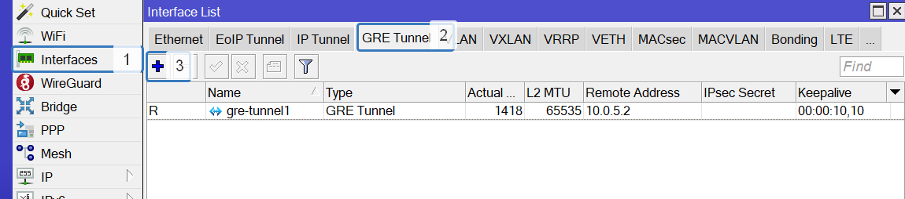

4. Задаем имя интерфейса
5. Указываем IP адрес источника туннеля
6. Указываем IP адрес назначения туннеля
7. Keepalive лучше отключить. У IPSec это есть в коробке. На циске он выключен по умолчанию. Кроме того в GRE он вреден.
8. Убираем галку `Allow Fast Path`

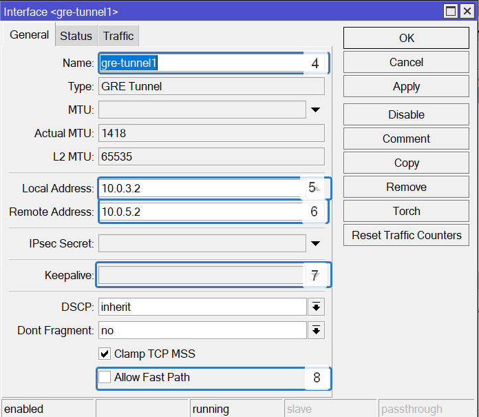

9. Переходим в пунки `IP`
10. Выбираем пункт `Addresses`
11. Нажимаем на `Плюс`

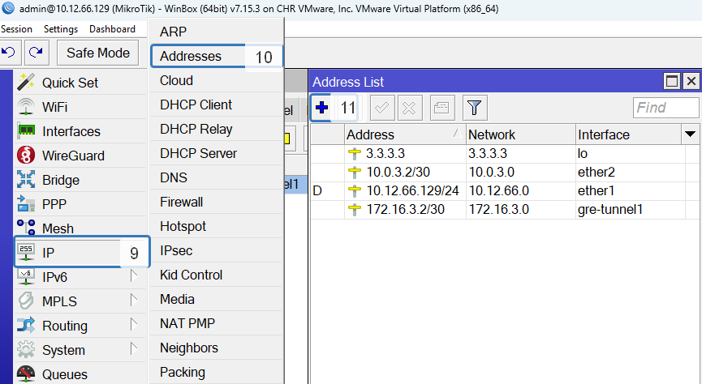

12. В поле `Address` вписываем IP адрес туннельной сети
13. В списке `Interface` выбираем созданный GRE интерфейс
14. (Optional) Тоже самое делаем с `Loopback` интерфейсом. Он сделан для проверки `OSPF`.

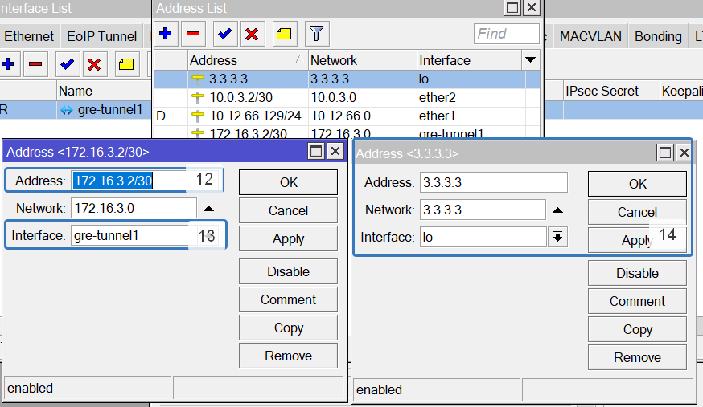

### Шаг 2. Настраиваем OSPF

1. Переходим в пункт `routing`
2. Выбираем пункт `OSPF`
3. Переходим во вкладку `Instance`
4. Нажимаем на кнопку `Плюс`
5. В поле `Name` указываем имя экземпляра. Остальное по дефолту

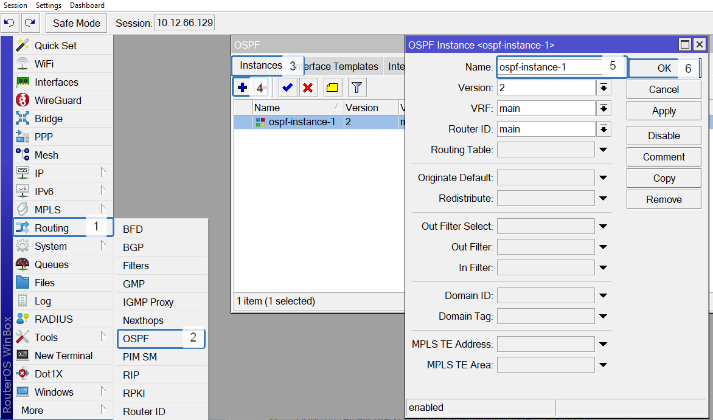

6. Переходим во вкладку `Areas`
7. Создаем новую область
8. В поле `Name` указываем имя новой области
9. Из списка `Instance` выбираем экземпляр созданный на прошлом этапе
10. В поле `Area ID` указываем номер области
11. Нажимем кнопку `OK`

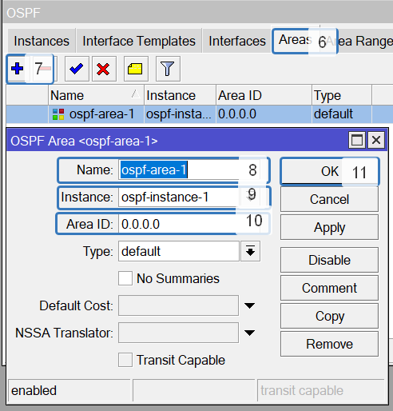

12. Переходим во вкладку `Interfaces Templates`
13. Добавляем новый шаблон
14. В пункте `Interfaces` выбираем GRE интерфейс
15. В пункте `Area` добавляем облась созданную на предыдущем этапе
16. В пункте `Network Type` выбираем пункт `ptp`

17. Такой же шаблон создаем для `Loopback` интерфейса

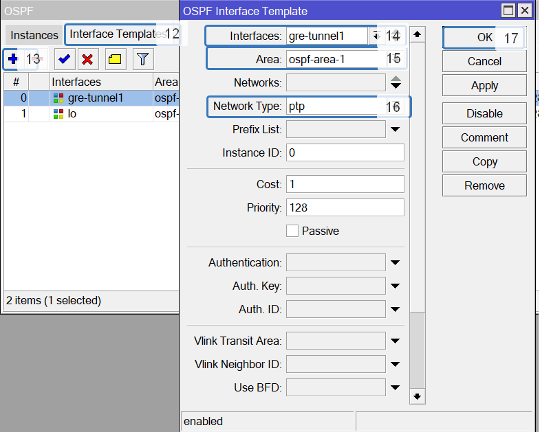

### Шаг 3. Настраиваем IPSec для шифрования GRE трафика

1. Выбераем пункт `IP`
2. Выбираем пункт `IPSec`
3. Переходим во вкладку `Profiles`
4. Добавляем новый профиль

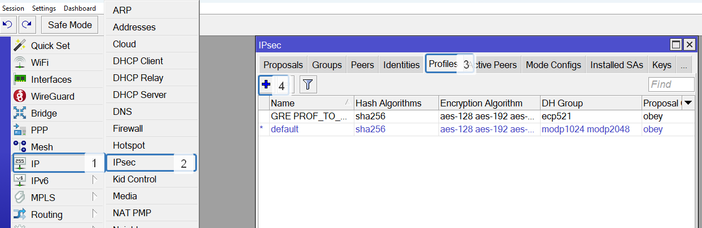

5. В поле `Name` задаем имя нового профиля
6. В поле `Hash Algorithms` выбираем `sha256`
7. В поле `Encryption Algorithm` выбираем `aes-256`
8. В поле `DH Group` выбираем `ecp521`
9. Нажимем кнопку `OK`

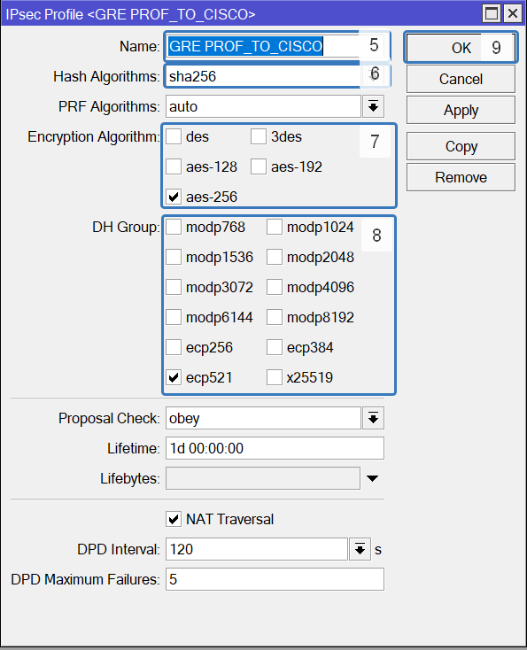

10. Перходим во вкладку `Peers`
11. Добавляем нового пира

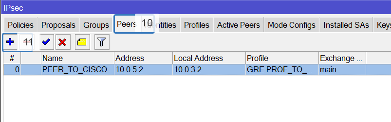

12. В поле `Name` задайте имя для пира
13. В поле `Address` задайте ip адрес соседа
14. В поле `Local Address` задайте свой ip адрес
15. В поле `Profile` выберите профиль созданный на прошлом этапе
16. Нажимаем кнопку `OK`

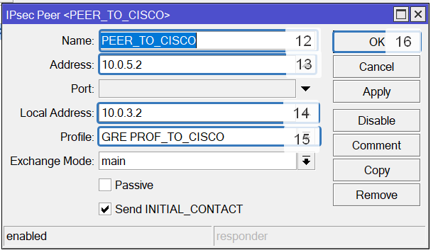

17. Переходим во вкладку `Identites`
18. Добавляем новый идентификатор

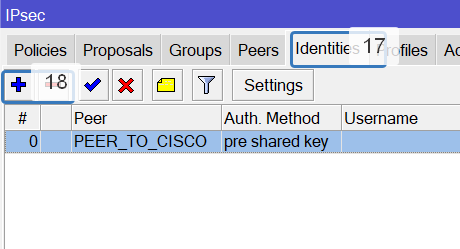

19. В поле `Peer` выберите пира созданного на прошлом этапе
20. В поле `Auth. Method` выберите `pre share key`
21. В поле `Secret` введите секретный ключ. В этом примере используется `Cisco123`
22. Нажмите кнопку `OK`

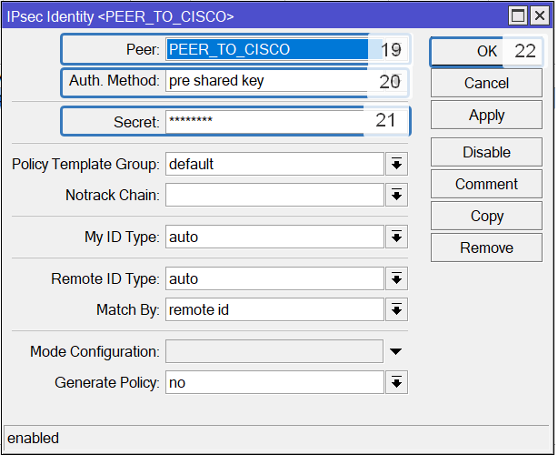

23. Переходим во вкладку `Proposals`
24. Добавляем новый

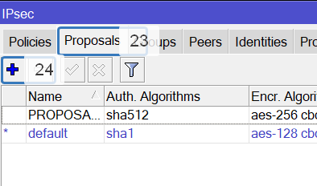

25. В поле `Name` введите новое имя
26. В поле `Auth. Algorithms` выберите протокол `sha512`
27. В поле `Encr. Algorithms` выберите протокол `aes-256 cbc`
28. В поле `PFS Group` выберите протокол `ecp521`
29. Нажмите кнопку `OK`

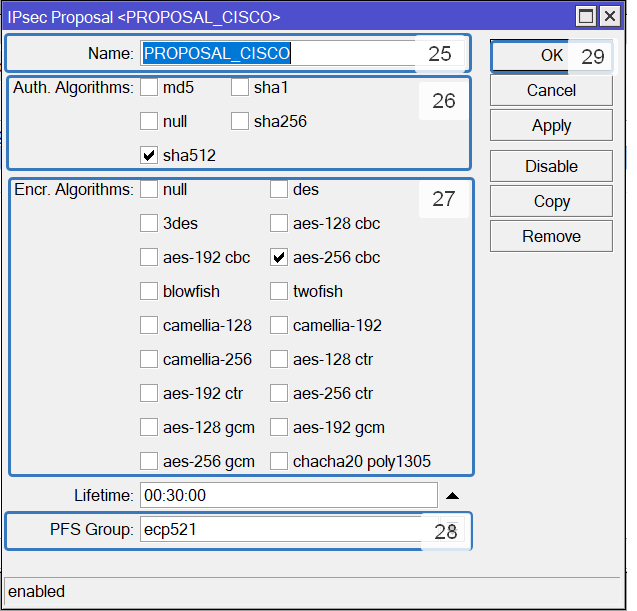

30. Переходим во вкладку `Policies`
31. Добавляем новую политику

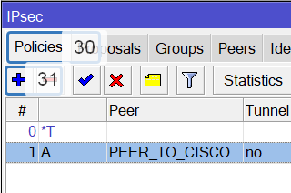

32. В поле `Peer` выберите пира, которого создали на предыдущем этапе
33. В поле `Src. Address` введите свой IP адрес
34. В поле `Dst. Address` введите IP адрес удаленного устройства
35. В поле `Protocol` введите номер протокола GRE `47`
36. Перейдите во вкладку `Actions`

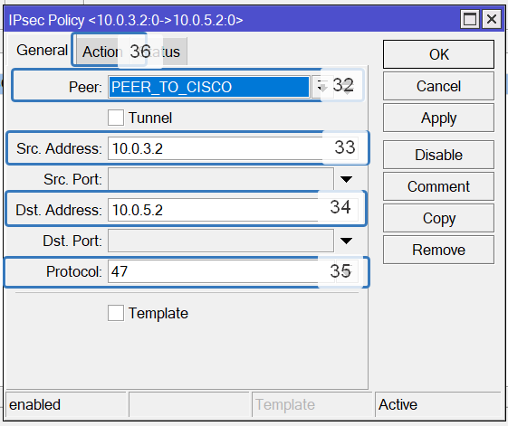

37. В поле `Proposal` выберите ранее созданный Proposal
38. Нажимаем кнопку `OK`

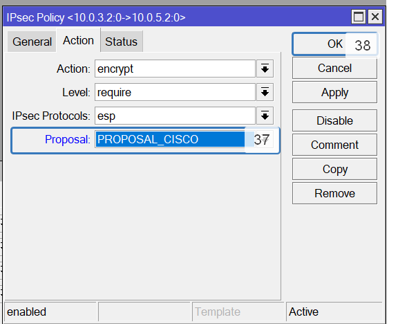

Если все сделано правильно, то вы увидите такую картину.

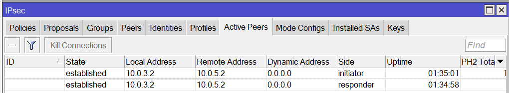
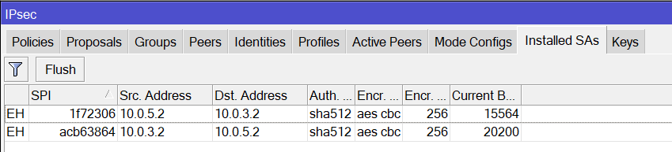
