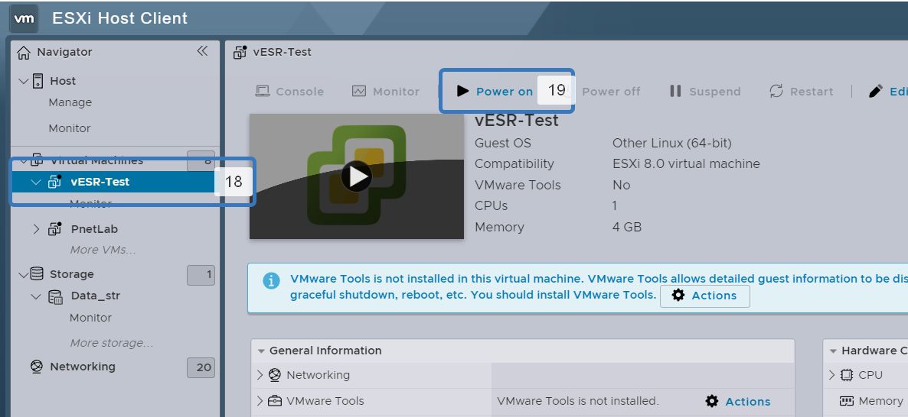
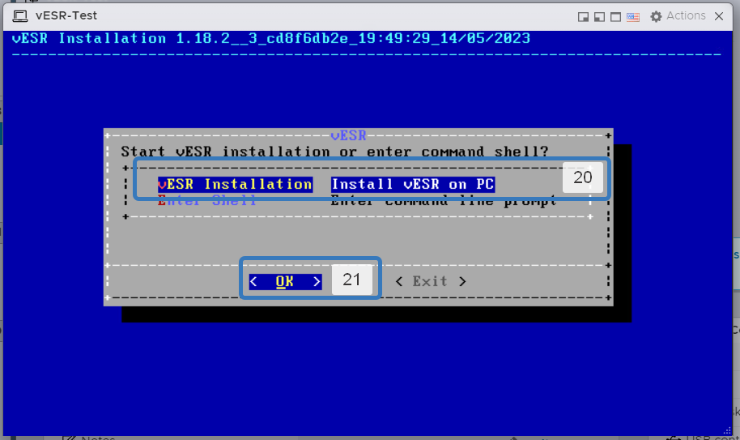

# Установка vESR на ESXI 8

Предвариетльно нужно получить `ISO` образ `vESR`. Это можно сделать на оффсайте `ELTEX` по запросу или просто загуглить.

У vESR есть FREE лицензия. Ограничения только пропускной способности в 1Мб/с

1. Нажимаем `Create/Register VM`.

2. Выбераем пункт `Create a new virtual machine`.

3. Нажимаем `Next` для перехода к следующему шагу.
4. Установите имя виртуальной машины.
5. Поле `Compatibillity` заполняется автоматически. Оставляем как есть.
6. Поле `Guest OS family` выберите операционную систему `Linux`.
7. Поле "Guest OS version" выберите любую 64-битную версию, например "Other Linux (64-bit)".
8. Нажимаем `Next` для перехода к следующему шагу.

9. Выбираем где будет храниться виртуальная машина.
10. Нажимаем `Next` для перехода к следующему шагу.

11. Установите `Memory` минимум 4 Гб.
12. Изменита настройка контроллера HDD на `IDE`

13. Удаляем `SCSI Controller`.
14. Удаляем `USB Controller`.
15. Изменяем `CD/DVD Drive` на `Datastore ISO file`

16. ВЫбираем предварительно загруженный ISO образ vESR
17. Нажимаем `SELECT`.

18. Выделяем созданную виртуальную машину.
19. Включаем ее.

После загрузки появиться меню выбора действий.

20. Вибираем `vESR installation`.
21. Нажимаем `OK`.

22. При помощи пробела выделите диск куда будет проходить установка.
23. Нажимаем `ОК`.

24. Соглашаемся с продолжением установки `Yes`.

25. После завершения установки перезагружаем виртуальную машину. Введите комманду `reboot`.

После переустановки нужно ввести дефолтные учетные данные. После этого нужно сразу сменить парооль администратора

26. Логин `admin`.
27. Пароль `password`.
28. Введите новый пароль. Пароль должен отличаться от дефолтного.
29. Зафиксируйте изменения введите `commit`.
30. Подтвердите изменения `confirm`.

Установка завершена.